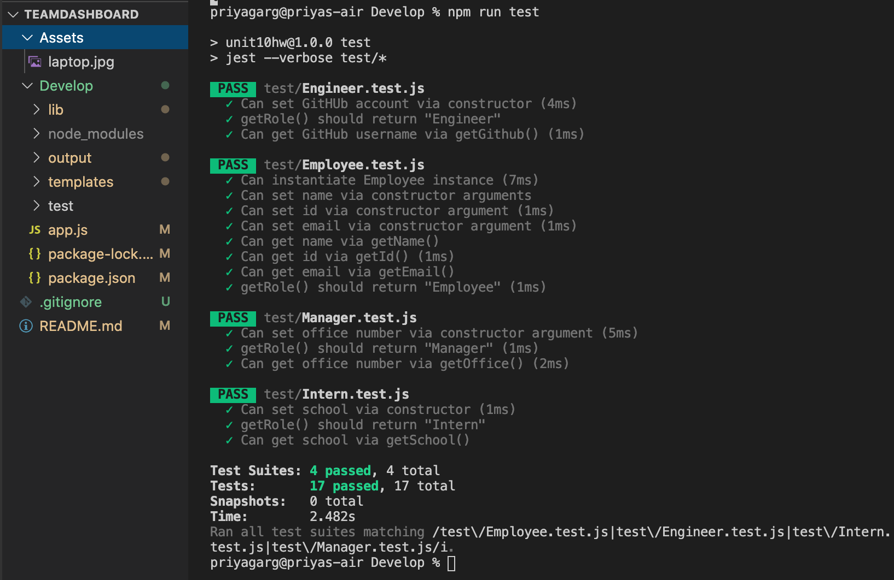

# TeamDashboard
## Description
Team Dashboard is a Node CLI application that takes in information about employees and generates an HTML webpage that displays summaries for each person on the team. Managers want quick access to their team's basic info such as email, gitHub usernames, and ID's. By prompting the user for information about the team manager and then information about the team members, the user can build a quick and convenient dashboard to access information. The user can input any number of team members and roles. Once the user has entered all members on the team the application generate an HTML file they can then access on the browser. 

## Table of Contents 

* [Installation](#Installation)
* [User Story](#UserStory)
* [Technologies_Used](#Technologies_Used)
* [Languages_Used](#Languages_Used)
* [Code_Snippet](#Code_Snippet)
* [Final_Result](#Final_Result)
* [ResourceReferred](#ResourceReferred)
* [Github_Links](#Github_Links)


## Installation
There are a few things that are required for this application. You will need to intsall the following: npm, inquirer, and node. Once these are installed in your CLI you will run the application by entering node app.js . Follow the prompts until all questions have been answered or you would no longer like to add anymore team members, then open the team.html file that is generated in the output directory.

## UserStory
As a manager <br>
I want to generate a webpage that displays my team's basic info<br>
so that I have quick access to emails and GitHub profiles

## Technologies_Used
Node.js - Used for package managment and to execute JavaScript code outside of a browser to build command line tool for server-side scripting.
Jest - Used to test and build Javascript classes and methods.
Inquirer - npm package installed by node used to promt user for employee info.
Javascript - Used to base functionality of functions and prompts within the application.
ES6 - Used to build prompts, functions, methods, and classes.
HTML - Used to generate HTML to be displayed in the browser.
CSS - Used to style html elements.
Git - Version control system to track changes to source code
GitHub - Hosts repository that can be deployed to GitHub Pages


## Languages_Used
1.Javascript<br>
2.HTML<br>
3.CSS <br>
4.Bootstrap


## Code_Snippet
Using classes as well as our templates again allows for greater modularity. Each piece can be built upon in the future and simply referenced elsewhere in the code or in other files by requiring the file that it lives on. In this way we are setting the base of our application to be more scalable.
```
class Employee {
    constructor (name, id, email) {
        this.name = name;
        this.id = id;
        this.email = email;
        
        
    }
    getName() {
        return this.name;
    }

    getId() {
        return this.id;
    }

    getEmail() {
        return this.email;
    }

    getRole() {
        return "Employee";
    }
}

module.exports = Employee;
```

## Final_Result
Testing 


## ResourceReferred
[For inquirer](https://www.npmjs.com/package/inquirer) <br>
[Constructors](https://www.w3schools.com/js/js_object_constructors.asp)<br>


## Github_Links
[**URL of My Github Repository**](https://github.com/guptaria/TeamDashboard)<br>
[**URL of Deployed Application**](https://guptaria.github.io/TeamDashboard/.)


